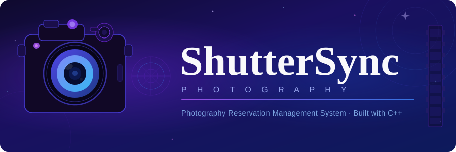

# 📸 ShutterSync: Photography Reservation Management System

<<p align="center">
  
</p>

<p align="center">
  
  
  
</p>

---

## 📋 Deskripsi Program

**ShutterSync** adalah aplikasi manajemen studio foto berbasis konsol yang dikembangkan menggunakan bahasa pemrograman **C++**. Program ini dirancang untuk membantu pengelolaan operasional studio foto secara digital, mulai dari manajemen data pelanggan, pemesanan paket foto, perhitungan biaya, hingga pelaporan pendapatan.

Sistem ini mendukung dua jenis pengguna:
- **Admin** — mengelola data pelanggan, konfirmasi & pembatalan reservasi, serta melihat laporan bisnis.
- **Visitor (Pelanggan)** — mendaftar akun, membuat reservasi, melihat status pemesanan, dan membatalkan reservasi.

Data disimpan secara persisten menggunakan file teks (`visitor.txt` dan `reservasi.txt`) sehingga data tidak hilang saat program ditutup.

---

## ✨ Fitur

### 👥 Kelola Data Pelanggan (Admin)
Menu ini diakses melalui **Menu Admin → Lihat Data Visitor**:
- **Tampilkan Semua Pelanggan** — Admin dapat melihat seluruh data visitor (username, nama lengkap, no. telepon, email).
- **Cari Pelanggan** — Admin dapat mencari data visitor berdasarkan username atau nama lengkap (pencarian case-insensitive).
- **Tambah Pelanggan** — Admin dapat menambahkan akun visitor baru langsung dari sisi admin dengan mengisi username, password, nama, no. telepon, dan email.

> Visitor juga dapat mendaftarkan diri sendiri melalui menu **Sign Up** di halaman awal.

### 📦 Pemesanan Paket Foto (Visitor)
Visitor dapat membuat reservasi melalui **Menu Visitor → Buat Reservasi**. Tersedia 4 paket foto:

| No | Paket       | Harga Dasar     |
|----|-------------|-----------------|
| 1  | Wisuda      | Rp 700.000      |
| 2  | Prewedding  | Rp 1.500.000    |
| 3  | Keluarga    | Rp 750.000      |
| 4  | Produk      | Rp 400.000      |

- **Input Tanggal Reservasi** — Tanggal wajib minimal H+1 dari hari ini (format: `DD/MM/YYYY`).
- **Input Durasi Sesi** — Pilih durasi antara **2 hingga 8 jam**.
- Setelah dibuat, status reservasi otomatis menjadi **Menunggu** hingga dikonfirmasi oleh admin.

### 💰 Perhitungan Biaya
- Harga paket sudah **mencakup 2 jam sesi** pertama.
- Setiap tambahan jam dikenakan biaya **Rp 100.000/jam**.
- Total biaya dihitung dan ditampilkan otomatis setelah reservasi dibuat.

> **Contoh:** Paket Wisuda (Rp 700.000) dengan durasi 5 jam  
> = Rp 700.000 + (3 jam × Rp 100.000) = **Rp 1.000.000**

### 🗂️ Manajemen Reservasi (Admin)
Menu ini diakses melalui **Menu Admin → Manajemen Reservasi**:
- **Tampilkan Semua Reservasi** — Melihat seluruh data reservasi dari semua visitor beserta ID, paket, tanggal, durasi, total biaya, dan status.
- **Konfirmasi Reservasi** — Mengubah status reservasi dari *Menunggu* menjadi *Dikonfirmasi* berdasarkan ID reservasi.
- **Batalkan Reservasi** — Admin dapat membatalkan reservasi mana saja dengan mengubah statusnya menjadi *Dibatalkan*.

> Visitor juga dapat membatalkan reservasi miliknya sendiri melalui **Menu Visitor → Batalkan Reservasi**, namun hanya jika status masih *Menunggu*.

### 📊 Laporan (Admin)
Menu ini diakses melalui **Menu Admin → Laporan**:
- **Laporan Jumlah Reservasi** — Menampilkan seluruh daftar reservasi beserta rekap jumlah per status (Menunggu, Dikonfirmasi, Dibatalkan).
- **Laporan Total Pendapatan** — Menampilkan breakdown pendapatan per paket (Wisuda, Prewedding, Keluarga, Produk) beserta total keseluruhan. Reservasi yang dibatalkan tidak dihitung dalam pendapatan.

---

## 🚀 Cara Pakai

### Prasyarat
- Compiler C++
- Terminal / Command Prompt

### Kompilasi & Jalankan

```bash
# Clone repositori ini
git clone https://github.com/Anas17012007/Shuttersync-Photography.git
cd Shuttersync-Photography

# Kompilasi
g++ -o main main.cpp

# Jalankan
main.exe      # Windows
```

### Alur Penggunaan

#### Sebagai Visitor (Pelanggan)
1. Pilih **`2. Visitor`** dari menu utama.
2. Pilih **`2. Sign Up`** untuk membuat akun baru — isi username, password, nama lengkap, no. telepon, dan email.
3. Pilih **`1. Sign In`** untuk masuk dengan akun yang sudah ada.
4. Setelah masuk, pilih **`1. Buat Reservasi`** untuk memesan sesi foto.
5. Pilih paket (1–4), masukkan tanggal (format `DD/MM/YYYY`, minimal H+1), dan durasi (2–8 jam).
6. Total biaya ditampilkan otomatis, status reservasi awal: **Menunggu**.
7. Pantau status reservasi melalui **`2. Lihat Reservasi Saya`**.
8. Batalkan reservasi via **`3. Batalkan Reservasi`** — hanya bisa jika status masih *Menunggu*.

#### Sebagai Admin
1. Pilih **`1. Admin`** dari menu utama lalu **`1. Sign In`**.
2. Masukkan username dan password admin.
3. Akses menu admin:
   - **`1. Lihat Data Visitor`** — tampilkan semua pelanggan, cari, atau tambah pelanggan baru.
   - **`2. Manajemen Reservasi`** — tampilkan semua reservasi, konfirmasi, atau batalkan reservasi.
   - **`3. Laporan`** — lihat laporan jumlah reservasi dan laporan total pendapatan per paket.

#### Daftar Akun Admin Default

| Username | Password       |
|----------|----------------|
| Solose   | Solose17012007 |
| Cayla    | Cayla123       |
| Dicky    | Dicky123       |
| Tiara    | Tiara123       |
| Putri    | Putri123       |
| Jihan    | Jihan123       |

> ⚠️ Data visitor dan reservasi disimpan otomatis di `visitor.txt` dan `reservasi.txt` pada direktori yang sama dengan program.

---

## 🗃️ Struktur File

```
Shuttersync-Photography/
├── main.cpp          # Source code utama
├── visitor.txt       # Database pelanggan (dibuat otomatis)
├── reservasi.txt     # Database reservasi (dibuat otomatis)
└── README.md
```

---

## 👨‍💻 Contributors

| Nama | Role |
|------|------|
| **Solose** | Lead Developer |
| **Cayla** | Developer |
| **Dicky** | Developer |
| **Tiara** | Developer |
| **Putri** | Developer |
| **Jihan** | Developer |

---

## 📄 Lisensi

Proyek ini dibuat untuk keperluan akademik dalam rangkaian Praktikum Algoritma dan Pemrograman 2026. Seluruh hak cipta milik tim pengembang ShutterSync.